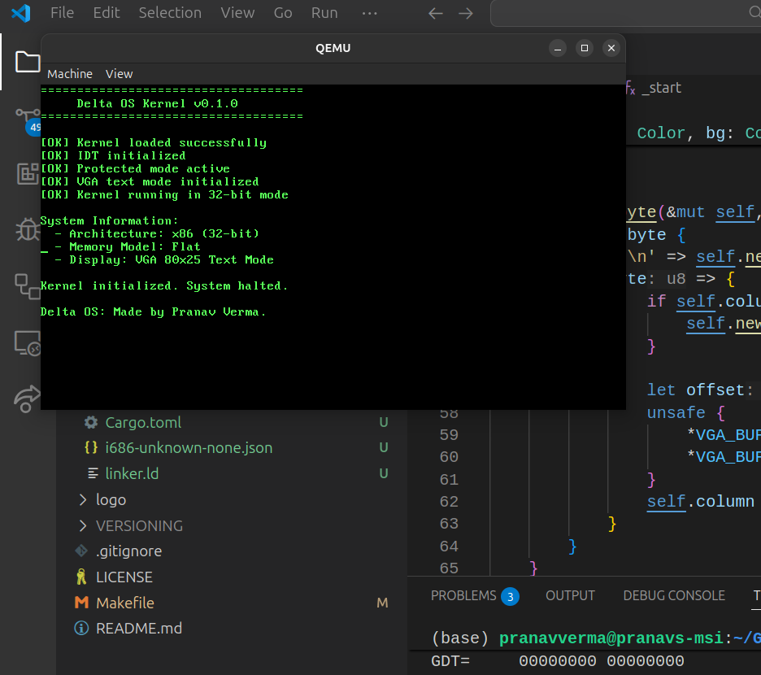

# Delta Operating System

A Lightweight Hobby Operating System Designed around the [Delta](https://github.com/Delta-Engine/Delta) Programming Language.
Made by Pranav Verma.



## Dependencies

To build and run Delta OS, you need the following tools installed:

- **NASM** (Netwide Assembler) - For assembling the bootloader
- **QEMU** - For running and testing the OS
- **Make** - For building the project

### Installing Dependencies

#### Ubuntu/Debian
```bash
sudo apt-get install nasm qemu-system-x86 make
```

#### Arch Linux
```bash
sudo pacman -S nasm qemu make
```

#### macOS
```bash
brew install nasm qemu make
```

#### Fedora
```bash
sudo dnf install nasm qemu-system-x86 make
```

## Building and Running

```bash
# Build the bootloader
make build

# Build and run in QEMU
make run

# Show available commands
make help
```